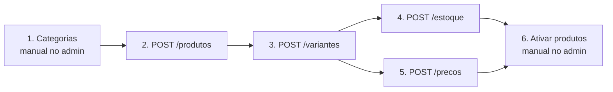

## Ordem obrigatória

A carga inicial precisa respeitar dependências de foreign key. Se você tentar variantes antes de produtos, o backend rejeita (produto pai não existe).



## Passo a passo

<Steps>
  <Step title="Cadastrar categorias no admin da loja">
    Categorias **não** vêm da API — são cadastradas manualmente no admin da loja parceira. Coordene com a loja: eles criam as categorias e vinculam cada uma a um `hunter_id` (identificador que você vai usar em `categoria_hunter_id` no `POST /produtos`).

    <Note>
    Este é o único passo manual da carga inicial. Depois de acertado, tudo é automático.
    </Note>
  </Step>

  <Step title="Enviar produtos em lotes de até 500">
    Use [`POST /produtos`](/api-reference/produtos/criar). Cada produto entra com `ativo=false` — invisível pra clientes até a loja ativar.

    ```javascript
    async function enviarProdutosEmLotes(produtos, batchSize = 500) {
      for (let i = 0; i < produtos.length; i += batchSize) {
        const lote = produtos.slice(i, i + batchSize);
        const res = await fetch(`${BASE_URL}/produtos`, {
          method: "POST",
          headers: { "X-API-Key": KEY, "Content-Type": "application/json" },
          body: JSON.stringify({ produtos: lote }),
        });
        const { data } = await res.json();
        console.log(`Lote ${i / batchSize + 1}: ${data.criados} criados, ${data.erros} erros`);
      }
    }
    ```

    Verifique `resultados[]` no response. Erros comuns nesta fase:
    - `categoria_hunter_id` não encontrada → aparece como aviso (produto é criado sem categoria)
    - `hunter_id` duplicado → segundo envio é UPDATE (não erro)
  </Step>

  <Step title="Enviar variantes">
    Use [`POST /variantes`](/api-reference/variantes/upsert). Cada variante precisa de `produto_hunter_id` apontando pra produto já cadastrado.

    Envie após todos os produtos estarem no ar. Se você envia um lote de variantes cujos produtos pai estão em lote posterior, várias falharão (erro individual).

    ```javascript
    for (let i = 0; i < variantes.length; i += 500) {
      await fetch(`${BASE_URL}/variantes`, {
        method: "POST",
        headers: { "X-API-Key": KEY, "Content-Type": "application/json" },
        body: JSON.stringify({ variantes: variantes.slice(i, i + 500) }),
      });
    }
    ```
  </Step>

  <Step title="Popular estoque inicial">
    Use [`POST /estoque`](/api-reference/estoque/atualizar). Envie o estado atual de cada SKU.

    Estoque `0` é valor válido (produto zerado, mas visível). Deixe `0` pros SKUs que você quer sinalizar como "sem estoque".
  </Step>

  <Step title="Popular preços iniciais">
    Use [`POST /precos`](/api-reference/precos/atualizar). Todo SKU precisa de preço `> 0` pra ser vendável.

    Se você quer aplicar promoção logo de cara, envie `preco_promocional` junto (deve ser menor que `preco`).
  </Step>

  <Step title="Aguardar admin da loja ativar">
    Loja abre `/admin/produtos`, revisa cada produto criado (imagens, descrições, ficha técnica) e clica em "Ativar". Só ativos aparecem pro cliente final.

    <Info>
    Este passo pode levar dias/semanas dependendo do volume — a loja provavelmente vai priorizar por categoria ou coleção.
    </Info>
  </Step>
</Steps>

## Verificar o resultado

Depois da carga, use [`GET /produtos`](/api-reference/produtos/listar) pra confirmar:

```bash
curl -G https://{loja}.com.br/api/hunter/v1/produtos \
  --data-urlencode "per_page=500" \
  -H "X-API-Key: hk_..."
```

Conte `paginacao.total` e compare com o esperado. Rode com `?hunter_id=<algum>` pra checar um específico.

## Após a carga inicial

- **Deltas**: use `POST /produtos` e `POST /variantes` só quando produto novo aparecer ou dimensões mudarem. Sync a cada 6h é suficiente.
- **Estoque + preço**: veja [Fluxo de estoque](/fluxo-estoque).
- **Pedidos**: veja [Fluxo de pedidos](/fluxo-pedidos).
