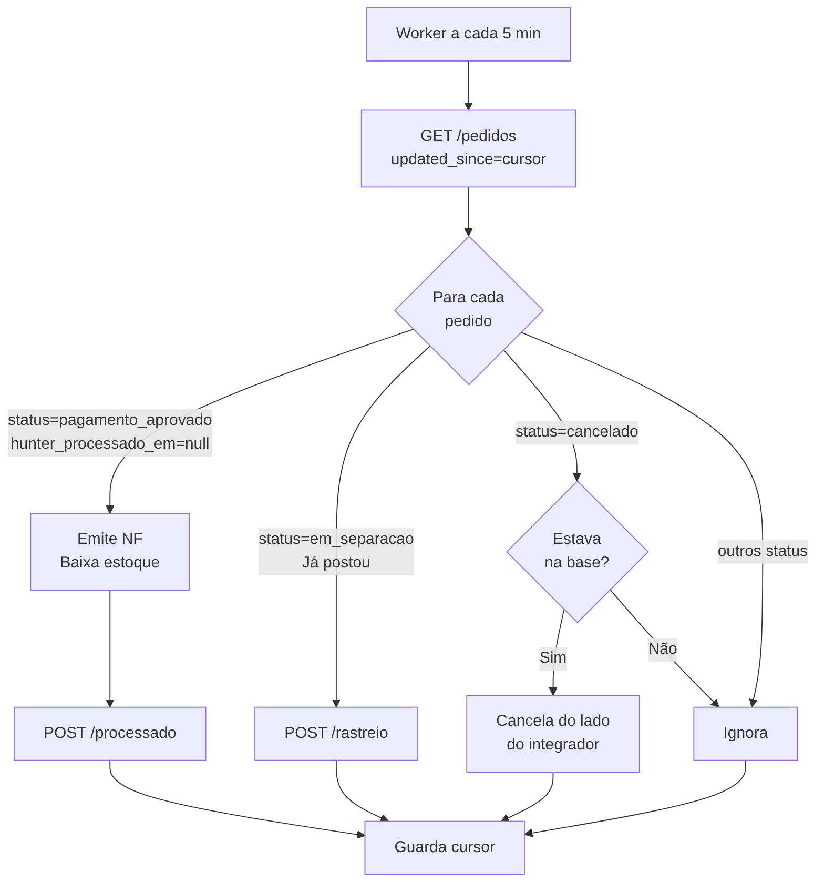

## Modelo geral



## Setup inicial

Primeiro pull: **sem** `updated_since`. Retorna todos os pedidos em status ativo.

```javascript
const params = new URLSearchParams({ limit: "200" });
const res = await fetch(`${BASE_URL}/pedidos?${params}`, {
  headers: { "X-API-Key": KEY },
});
const { data } = await res.json();

for (const pedido of data.pedidos) {
  await processarPedido(pedido);
  cursor = pedido.atualizado_em; // avança
}

saveCursor(cursor);
```

## Loop periódico (a cada 5 min)

```javascript
async function tickDePull() {
  const cursor = getSavedCursor(); // ISO 8601 do último pedido processado

  const params = new URLSearchParams({ limit: "200" });
  if (cursor) params.set("updated_since", cursor);

  const res = await fetch(`${BASE_URL}/pedidos?${params}`, {
    headers: { "X-API-Key": KEY },
  });

  if (!res.ok) {
    // 429/500 — backoff
    return handleErro(res);
  }

  const { data } = await res.json();
  let ultimoCursor = cursor;

  for (const pedido of data.pedidos) {
    try {
      await roteador(pedido);
      ultimoCursor = pedido.atualizado_em;
    } catch (err) {
      // Loga o erro mas NÃO avança cursor (retentará no próximo tick)
      logger.error({ codigo: pedido.codigo, err });
      break;
    }
  }

  if (ultimoCursor !== cursor) saveCursor(ultimoCursor);

  // Se tem_mais, dispara outro tick imediatamente
  if (data.paginacao.tem_mais) return tickDePull();
}

setInterval(tickDePull, 5 * 60 * 1000);
```

## Roteador por status

```javascript
async function roteador(pedido) {
  switch (pedido.status) {
    case "pagamento_aprovado":
      if (pedido.hunter_processado_em !== null) {
        return; // replay — ignora
      }
      return processarPedidoAprovado(pedido);

    case "em_separacao":
      // Se você processou (hunter_processado_em preenchido), o pedido está
      // aguardando você postar. Verifique seu WMS/ERP — assim que a etiqueta
      // for gerada e o pacote postar, chame POST /rastreio.
      return; // handled pelo evento de postagem no seu lado

    case "enviado":
    case "entregue":
      return; // fim do fluxo pro integrador

    case "cancelado":
      return processarCancelamento(pedido);
  }
}
```

## Processar pedido aprovado

```javascript
async function processarPedidoAprovado(pedido) {
  // 1. Baixa estoque local
  for (const item of pedido.itens) {
    await sistemaIntegrado.baixaEstoque(item.variante_hunter_id, item.quantidade);
  }

  // 2. Emite NF
  const nfe = await sistemaIntegrado.emitirNFe({
    cliente: pedido.cliente,
    endereco: pedido.endereco_entrega,
    itens: pedido.itens,
    total: pedido.total,
  });

  // 3. Confirma na loja
  await fetch(`${BASE_URL}/pedidos/${pedido.codigo}/processado`, {
    method: "POST",
    headers: { "X-API-Key": KEY, "Content-Type": "application/json" },
    body: JSON.stringify({
      nota_fiscal: {
        numero: nfe.numero,
        serie: nfe.serie,
        chave_acesso: nfe.chave,
        data_emissao: nfe.emitidaEm,
        url_danfe: nfe.pdfUrl,
      },
    }),
  });
}
```

## Registrar rastreio (evento separado)

Quando o pacote for postado, dispare o `POST /rastreio` — não faz sentido embutir no loop de pull (só saberá que postou no evento local, não pelo pull).

```javascript
// Evento "pacote postado" no seu WMS/ERP
async function onPacotePostado({ pedidoCodigo, codigoRastreio, transportadora, urlRastreio }) {
  await fetch(`${BASE_URL}/pedidos/${pedidoCodigo}/rastreio`, {
    method: "POST",
    headers: { "X-API-Key": KEY, "Content-Type": "application/json" },
    body: JSON.stringify({
      codigo_rastreio: codigoRastreio,
      transportadora: transportadora,
      url_rastreio: urlRastreio,
    }),
  });
}
```

## Cancelamento (integrador reagindo)

Se você recebe `pedido.status === "cancelado"` e o pedido **estava na sua base** (você já processou):

```javascript
async function processarCancelamento(pedido) {
  const existeNoLocal = await sistemaIntegrado.existePedido(pedido.codigo);
  if (!existeNoLocal) return; // ignora — nunca chegou a entrar

  // Cancela do lado do integrador (estorna NF, restora estoque, etc)
  await sistemaIntegrado.cancelarPedido(pedido.codigo, {
    motivo: pedido.cancelamento?.motivo ?? "Cancelamento sincronizado da loja",
    dataOriginal: pedido.cancelamento?.cancelado_em,
  });
}
```

## Idempotência: casos de replay

Como o `updated_since > cursor` é filtro rígido, você **nunca** deveria receber o mesmo pedido duas vezes num pull normal. Mas atenção a:

- **Race condition**: se o pedido é atualizado exatamente no momento do pull, ele pode ficar de fora (será pego no próximo tick). Não é bug, é natureza do cursor.
- **Reset de cursor**: se você perder o cursor local e reprocessar tudo, use `hunter_processado_em` pra pular pedidos já processados. Chamar `POST /processado` num pedido já processado retorna `409 CONFLICT` — trate como sinal "OK, já foi".

## Erros e retentativas

- `5xx` no `GET /pedidos` — backoff, retente. Cursor não avançou, você não perde nada.
- `429` — aguarde `Retry-After`.
- `5xx` no `POST /processado` — investigue via `GET /pedidos?updated_since=<cursor_anterior>` se o pedido apareceu com `hunter_processado_em` preenchido. Se sim, foi um retry silencioso — siga.
- `409` no `POST /processado` — já processou; loga como aviso e segue.
- `409` no `POST /rastreio` — pedido saiu de `em_separacao`/`enviado` (foi entregue ou cancelado); loga e siga (rastreio já não faz sentido).

## Frequência sugerida

- Loop de pull: **a cada 5 minutos**
- `POST /rastreio`: **evento** disparado pelo WMS (não é loop)
- `POST /processado`: dentro do loop de pull, imediato após emitir NF

Se seu volume é baixo (< 100 pedidos/dia), pode espaçar pra 15 min. Se é alto (> 10k pedidos/dia), reduza pra 1 min mas cuide do rate limit.
